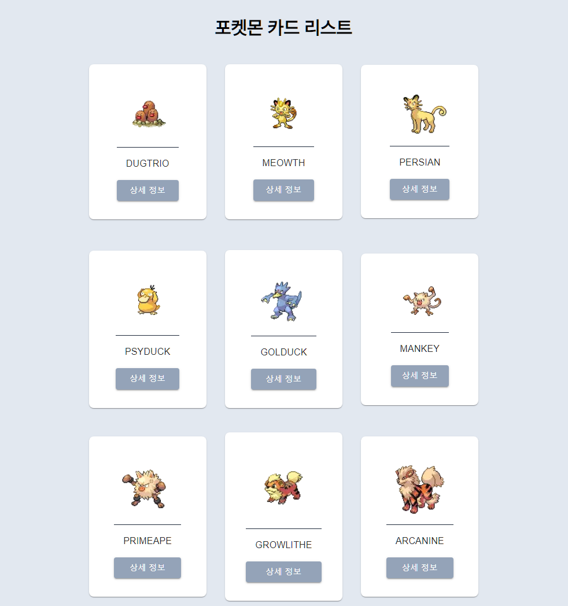
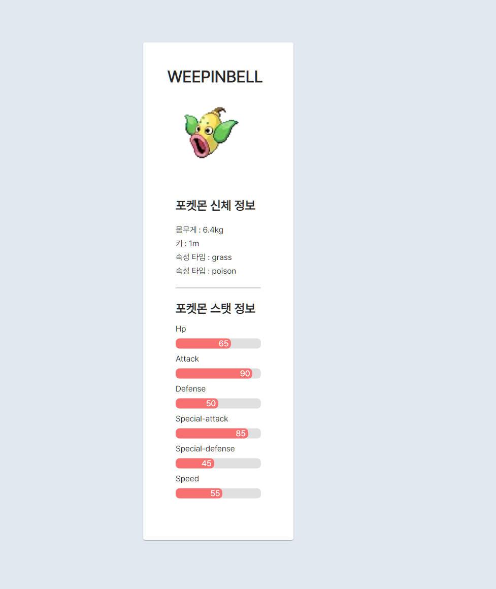

# 공학도서관 미니과제

- 포켓몬데이터를 렌더링하고, 사용자가 무한스크롤을 통해 다양한 포켓몬을 탐색할 수 있으며, 특정 포켓몬 상세 정보 클릭시, 상세페이지로 이동하여 해당 포켓몬에 대한 자세한 정보를 볼 수 있는 웹 애플리케이션으로 구성했습니다.

## 📑 기술스택

- TypeScript
- Nextjs
- Tanstack Query
- Emotion/MUI
- Axios

## 프로젝트 셋업

### 데모페이지

- [Pokemon Card](https://engineering-library-assignment.vercel.app/)

### 로컬환경

```bash

1. 프로젝트 복사

npx degit https://github.com/suwan98/engineering-library-assignment.git

/* OR */
git clone https://github.com/suwan98/engineering-library-assignment.git


2. 프로젝트 의존성 설치

pnpm install


3. 프로젝트 실행

pnpm dev


```

## 👨‍💻 구현 목표

- [x] 페이지 기본 레이아웃 구현
- [x] Pokemon API를 통한 포켓몬 데이터 렌더링
- [x] 용자의 스크롤을 추적하여 나열된 목록의 끝에 도달시 추가 조회
- [x] 카드 클릭 시, 상세페이지로 넘어가며, 해당 프로덕트에 대한 상세내용 렌더링

## 📦 폴더구조

📦src
┣ 📂app
┃ ┣ 📂fonts
┃ ┃ ┣ 📜Pretendard-Bold.woff2
┃ ┃ ┣ 📜Pretendard-Regular.woff2
┃ ┃ ┗ 📜Pretendard-SemiBold.woff2
┃ ┣ 📂[detail]
┃ ┃ ┗ 📂[slug]
┃ ┃ ┃ ┗ 📜page.tsx
┃ ┣ 📜error.tsx
┃ ┣ 📜favicon.ico
┃ ┣ 📜layout.tsx
┃ ┣ 📜loading.tsx
┃ ┗ 📜page.tsx
┣ 📂components
┃ ┣ 📂common
┃ ┃ ┣ 📜Container.tsx
┃ ┃ ┗ 📜Header.tsx
┃ ┣ 📂Detail
┃ ┃ ┣ 📜PokemonPhysical.tsx
┃ ┃ ┗ 📜PokemonStats.tsx
┃ ┗ 📂PokemonCards
┃ ┃ ┣ 📜PokeCard.tsx
┃ ┃ ┗ 📜PokeCardList.tsx
┣ 📂constants
┃ ┗ 📜POKE_BASE_URL.ts
┣ 📂hooks
┃ ┣ 📜usePokemonDetail.tsx
┣ 📂provider
┃ ┗ 📜ReactQueryProvider.tsx
┣ 📂service
┃ ┗ 📜fetchPokemonService.ts
┗ 📂styles
┃ ┗ 📜globalStyle.tsx

- `📂 [detail]` : nextjs 14버전 폴더기반 라우팅을 기반으로 상세페이지 이동경로를 /detail/slug(예시 : /detail/dugtrio)로 이동하도록 폴더를 구성했습니다.
- `📜 error.tsx/loading.tsx` : 마찬가지로 nextjs는 파일기반 에러페이지/로딩페이지 ui를 지원하므로 app 디렉토리 내부에서 구성했습니다.
- `📂components` : 컴포넌트 폴더 내부 공통으로 사용되는 `common` 폴더
  - 디테일 페이지에 사용되는 컴포넌트들을 담아둔 `Detail` 폴더
  - 메인페이지에서 포켓몬리스트를 렌더링하기 위한 `📂PokemonCards` 폴더로 구성했습니다.
- `📂constants` : http 통신을 위한 pokeAPI의 기본 URL과 추가적으로 포켓몬 이미지를 로드하기 위한 기본 이미지 URL을 구성했습니다.
- `📂hooks` : pokeAPI 특성상, 해당 포켓몬에 대한 상세정보에 진입 시 추가적으로 HTTP 통신이 필요해, usePokemonDetail이라는 커스텀훅을 통해 포켓몬에 대한 상세정보를 가져오는 로직을 작성했습니다.
  - useReactQuery :
- `📂provider` : Tanstack-Query라이브러리를 사용해 애플리케이션 서버 상태를 관리하기 위한 컴포넌트를 구성했습니다.
  - TanStack Query의 기능을 제공하는데 필요한 Query Client 인스턴스를 초기화하고, 이를 애플리케이션 컴포넌트 트리에 제공하는 역할을 합니다.
- `📂service` : 애플리케이션의 전반적인 비동기 통신 로직을 가지고 있는 파일입니다.
  - 해당 파일 내에서 무한스크롤 구현을 위한 페이지네이션 처리 준비/포켓몬 이미지 추출등에 관한 로직이 포함됩니다.

## 😀 핵심 기능 설명

### Tanstack Query의 useInfinity Query를 통한 무한스크롤 구현

**1. react-intersection-observer 라이브러리의 `useInView` hook과 `useEffect`내부 로직을 통해 사용자가 스크롤 끝에 다달랐을시, 추가적인 데이터를 로드하는기 위해 사용했습니다.**

**2. `useInfiniteQuery`**

- `queryFn` : 구성한 service 폴더 내 데이터를 불러오는 함수를 포함하며, pageParam을 인자로 받아 해당 페이지의 데이터를 불러오는 역할을 하게 됩니다.
- `initialPageParam` : 최초로 렌더링 할 페이지 번호입니다.
- `getNextPageParam` : 다음 페이지를 불러올 때 사용할 페이지 파라미터를 결정하는 함수입니다. 여기서는 5페이지까지만 데이터를 불러오고, 그 이후는 `undefined`를 반환하여 더 이상 페이지를 불러오지 않습니다.

```tsx
const {ref, inView} = useInView();

const {
  data: pokeomons,
  hasNextPage,
  fetchNextPage,
} = useInfiniteQuery({
  queryKey: ["pokemons"],
  initialPageParam: 1,
  queryFn: ({pageParam = 1}) => fetchPokemonService(pageParam),
  getNextPageParam: (_, pages) => {
    if (pages.length < 5) {
      return pages.length + 1;
    } else return undefined;
  },
});

useEffect(() => {
  if (inView && hasNextPage) {
    fetchNextPage();
  }
}, [fetchNextPage, hasNextPage, inView]);
```

**3. 스크롤 이벤트와 페이지 로드**

- `useEffect` 훅을 사용하여, 사용자가 설정한 요소를 보고 있고(inView), 다음 페이지가 있다면(hasNextPage), fetchNextPage 함수를 호출하여 다음 페이지의 데이터를 불러오도록 구성했습니다

### 특정 집단 군의 다수 자료 나열



- 기본적으로 데이터들이 `PokeCardList`와 내부 `PokeCard` 컴포넌트로 렌더링되도록 구성했습니다.
  - `PokeCardList`는 `grid`를 통해 3x3 테이블로 나누어졌으며,
  - `PokeCard`는 material ui의 Card 컴포넌트를 상속받고 확장해 `Card`에 대한 추가적인 스타일링을 했습니다.

```js
/* PokeCardList.tsx */
const PokeList = styled.ul`
  margin-top: 2rem;
  margin-bottom: 4rem;
  display: grid;
  grid-template-columns: 1fr 1fr 1fr;
  grid-template-rows: 1fr 1fr 1fr;
  align-items: center;
  justify-content: center;
  gap: 2rem;
  cursor: pointer;
`;

/* PokeCard.tsx */
const PokeCardStyle = styled(Card)`
  max-width: 21rem;
  padding: 2rem;
  display: grid;
  align-items: center;
  justify-content: center;
  border-radius: 0.5rem;
`;

const PokeCardContent = styled(CardContent)`
  border-top: 1px solid rgb(30 41 59);
`;

const PokeCardTypography = styled(Typography)`
  text-transform: uppercase;
  text-align: center;
`;

const PokeCardButton = styled(Button)`
  background-color: rgb(148 163 184);

  &:hover {
    background-color: rgb(100 116 139);
  }
`;
```

### 상세 페이지 구현

- 상세페이지는 `usePokemonDetail` 커스텀훅을 기반으로 만들어졌습니다.
- 사용자가 특정 포켓몬 클릭시 특정 포켓몬의 이름을 기반으로 라우팅되며 (예시 : http://localhost:3000/detail/weepinbell)
- 해당 상세페이지에는 포켓몬의 이름, 신체정보, 스탯정보등의 ui가 표시되어있습니다.
  - 신체정보와 스텟정보는 각각 PokemonPhysical/PokemonStats 컴포넌트로 분리했습니다.
    
